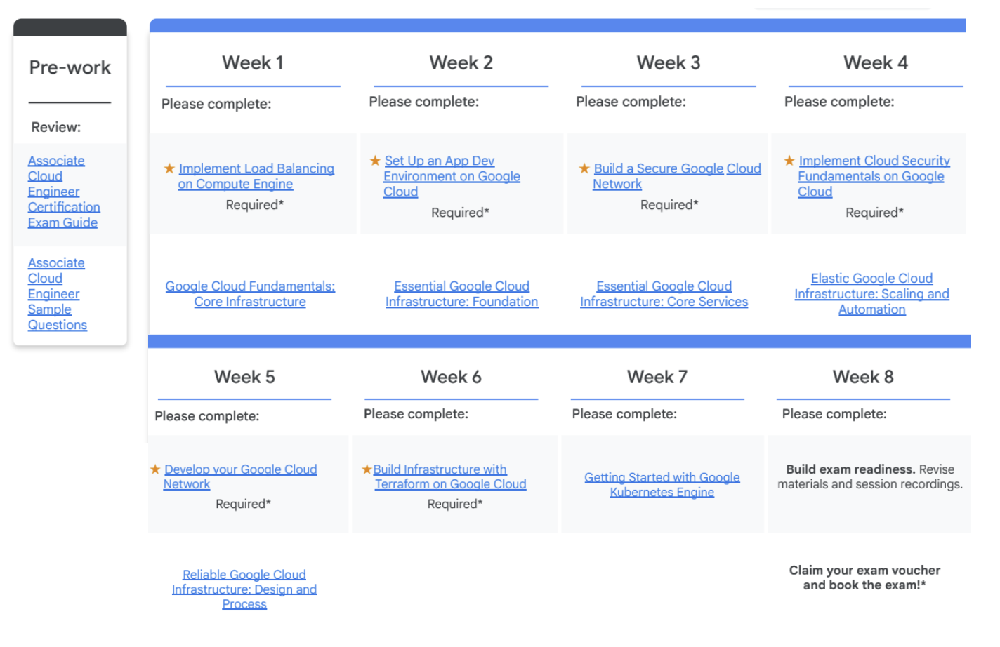

# Associate Cloud Engineer Certificate 2025

This repository documents how I studied for — and passed on Friday 13th (not a good day but still...) — the [Associate Cloud Engineer (ACE)](https://cloud.google.com/learn/certification/cloud-engineer) certification without spending a single cent. 💸

I’ve included all the resources, strategies, and tips I used along the way, so you can follow the same path and earn your certification too. Whether you're looking to boost your cloud skills, level up your resume, or break into tech, I hope this helps you on your journey to master Google Cloud — for $0.

Let’s get you certified! ☁️✅

## Learning plans

I joined the no-cost [2025 Get Certified](https://cloud.google.com/innovators/getcertified?) (A HUGE THANKS to Google and the program falicitors), which offered several benefits to help you access to the resources and the test, including:
1. 8 week guided learning program
2. Technical membership (both Exam guide review sessions and supports via Online community)
3. **Exam voucher information** (FREE 💸💸💸)
4. 400 free credits for hand-on labs in Google Cloud Skill Boost.

I would highly recommend you to stick to the 8-week learning timeline suggested by Get Certified as below:

  

## Resources
The following resources are recommended to help prepare for the exam:

||Types| Links| 
|-|-|-|
|0|Exam Guide| [Certification exam guide](https://services.google.com/fh/files/misc/associate_cloud_engineer_exam_guide_english.pdf) (MUST READ)|
|1|Course + Labs| [Cloud Engineer Learning Path](https://www.cloudskillsboost.google/paths/11) (PRACTICE MAKES PERFECT)|
|2|Books|[Associate Cloud Engineer Study Guide](http://repo.darmajaya.ac.id/4482/1/Official%20Google%20Cloud%20Certified%20Associate%20Cloud%20Engineer%20Study%20Guide%20%28%20PDFDrive%20%29.pdf) (OLD BUT GOLD) | 
|3|Video| [Google Cloud Associate Cloud Engineer Course - Pass the Exam!](https://www.youtube.com/watch?v=jpno8FSqpc8&t=69538s&ab_channel=freeCodeCamp.org) |
|4|Labs| [Skill Boost ARCADE](https://go.cloudskillsboost.google/arcade) (PRACTICE MAKES PERFECT) |

These are the sample questions I studied to understand the exam format and test my knowledge after completing the above materials:
1. [Associate Cloud Engineer Sample Questions](https://docs.google.com/forms/d/e/1FAIpQLSfexWKtXT2OSFJ-obA4iT3GmzgiOCGvjrT9OfxilWC1yPtmfQ/viewform) provided by Google
2. [Real Google Associate Cloud Engineer Study Questions](https://www.p2pexams.com/free/real-google-associate-cloud-engineer-study-questions-by-cleveland.pdf) (14 free PDFs verified question answers)
3. [LearnGood](https://www.learngood.com/#/course/Google%20Cloud%20Engineer) (193 questions covering all exam topics)

I hope this would help you during your studying journey and GOOD LUCK WITH THE EXAM 🚀🚀🚀

## Contribution
💡 Got any cool resources, tips, tricks, or courses that helped you study for the exam or tackle real-world GCP use cases?
Feel free to contribute to this repository by submitting a pull request — let’s build a helpful, community-driven guide together! 🚀

## Disclaimer
This guide is not affiliated with or endorsed by Google.